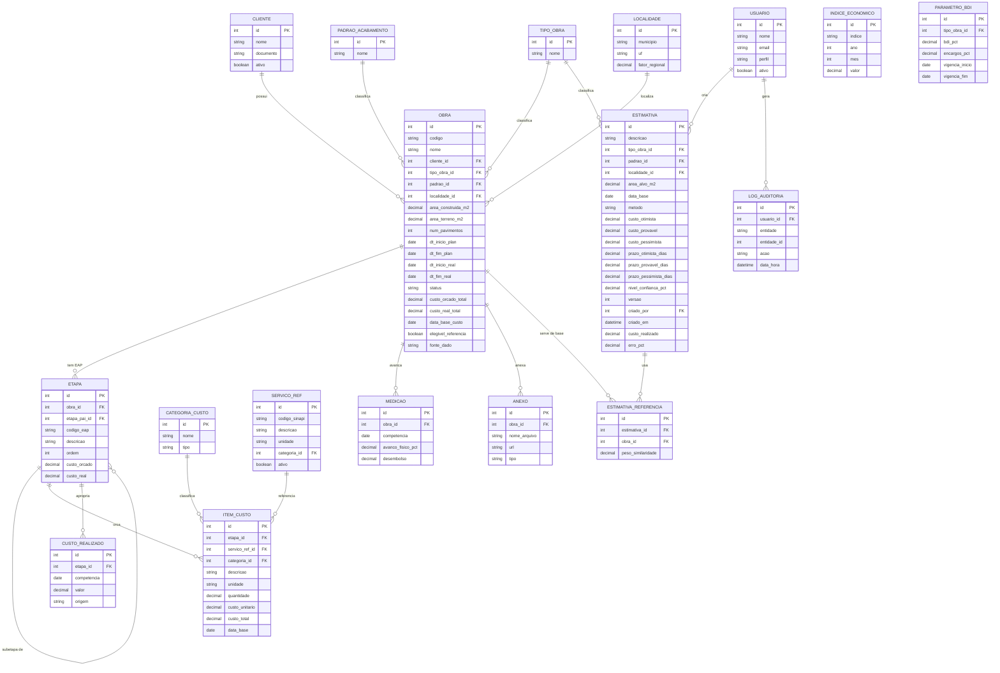

# 04 — Modelo de Dados

Modelo lógico relacional para registrar obras, sua estrutura de custos (orçados e
realizados), prazos e as estimativas geradas a partir do histórico.

**Implementação (confirmada):** PostgreSQL no Neon, em um **schema próprio `orcamento`**,
sem alterar nenhuma tabela do app (`public.*`). Os identificadores são **`text`** (padrão
do sistema atual, ex.: `genId('obra')`) e a identidade reaproveita **`public.users`**
(somente leitura). O DDL pronto está em
[`db/migrations/001_orcamento_schema.sql`](../db/migrations/001_orcamento_schema.sql) — é
a **fonte de verdade** dos tipos reais.

## 1. Diagrama Entidade-Relacionamento

> O diagrama acima usa **Mermaid** — renderiza no GitHub/GitLab e na maioria dos
> visualizadores de Markdown. Se o seu editor não renderizar, cole o bloco em
> [mermaid.live](https://mermaid.live).
>
> ⚠️ **Tipos no diagrama são ilustrativos.** Na implementação PostgreSQL, os ids/FKs são
> `text` (padrão do app) e os valores monetários `numeric`. `USUARIO` **não é uma tabela
> nova** — é a `public.users` existente, referenciada por valor (sem FK). Tipos reais na
> [migration 001](../db/migrations/001_orcamento_schema.sql).

## 2. Visão geral das entidades

| Entidade | Papel |
|----------|-------|
| **OBRA** | Núcleo do acervo: uma obra histórica com dados gerais, totais e data-base do custo. |
| **ETAPA** | Itens da EAP, hierárquicos (auto-relacionamento via `etapa_pai_id`). |
| **ITEM_CUSTO** | Custo **orçado** de um serviço dentro de uma etapa. |
| **CUSTO_REALIZADO** | Custo **realizado** (apropriado) por etapa/competência. |
| **SERVICO_REF** | Catálogo de serviços/composições de referência (vínculo opcional a SINAPI). |
| **CATEGORIA_CUSTO** | Material, mão de obra, equipamento, terceiros, indiretos. |
| **MEDICAO** | Avanço físico e desembolso por período (curva S). |
| **INDICE_ECONOMICO** | Série mensal de índices (INCC, SINAPI) para atualização monetária. |
| **PARAMETRO_BDI** | BDI e encargos por tipo de obra e vigência. |
| **ESTIMATIVA** | Estimativa de custo/prazo de um projeto novo, com faixa, método e versão. |
| **ESTIMATIVA_REFERENCIA** | Liga uma estimativa às obras que a embasaram (N:N) com peso. |
| **CLIENTE / TIPO_OBRA / PADRAO / LOCALIDADE** | Dimensões de classificação e similaridade (tabelas novas no schema `orcamento`). |
| **USUARIO** | **`public.users` existente** (reuso só-leitura) — identidade, `is_admin` e autoria. Não é tabela nova. |
| **ANEXO / LOG_AUDITORIA** | Apoio: documentos (bytea, como no app) e auditoria. |

## 3. Dicionário de dados (entidades principais)

### OBRA

| Campo | Tipo | Descrição |
|-------|------|-----------|
| id | int (PK) | Identificador. |
| codigo | string | Código interno da obra. |
| nome | string | Nome/descrição da obra. |
| cliente_id | FK | Cliente. |
| tipo_obra_id | FK | Tipo (residencial, comercial…). |
| padrao_id | FK | Padrão de acabamento. |
| localidade_id | FK | Município/UF. |
| area_construida_m2 | decimal | Área construída — base para custo/m². |
| area_terreno_m2 | decimal | Área do terreno. |
| num_pavimentos | int | Nº de pavimentos. |
| dt_inicio_plan / dt_fim_plan | date | Datas planejadas (prazo previsto). |
| dt_inicio_real / dt_fim_real | date | Datas reais (prazo realizado). |
| status | string | Em andamento, concluída, cancelada. |
| custo_orcado_total | decimal | Soma dos itens orçados. |
| custo_real_total | decimal | Soma dos custos realizados. |
| data_base_custo | date | Mês/ano de referência dos valores (para atualização). |
| elegivel_referencia | boolean | Se pode alimentar estimativas (RF-B07). |
| fonte_dado | string | manual / importado / conciliado. |

### ITEM_CUSTO

| Campo | Tipo | Descrição |
|-------|------|-----------|
| id | int (PK) | Identificador. |
| etapa_id | FK | Etapa da EAP a que pertence. |
| servico_ref_id | FK | Serviço de referência (opcional). |
| categoria_id | FK | Categoria de custo. |
| descricao | string | Descrição do item. |
| unidade | string | Unidade (m², m³, m, vb, h…). |
| quantidade | decimal | Quantidade. |
| custo_unitario | decimal | Custo por unidade. |
| custo_total | decimal | `quantidade × custo_unitario`. |
| data_base | date | Data-base do preço do item. |

### ESTIMATIVA

| Campo | Tipo | Descrição |
|-------|------|-----------|
| id | int (PK) | Identificador. |
| descricao | string | Nome do projeto a estimar. |
| tipo_obra_id / padrao_id / localidade_id | FK | Parâmetros de similaridade. |
| area_alvo_m2 | decimal | Área do projeto novo. |
| data_base | date | Data-base para a qual os custos foram atualizados. |
| metodo | string | analoga / parametrica / bottom_up / combinada. |
| custo_otimista / provavel / pessimista | decimal | Faixa de custo. |
| prazo_*_dias | decimal | Faixa de prazo. |
| nivel_confianca_pct | decimal | Confiança da estimativa. |
| versao | int | Versão/cenário. |
| criado_por | FK | Usuário autor. |
| custo_realizado | decimal | Preenchido quando a obra é executada (RF-F08). |
| erro_pct | decimal | Desvio estimado × realizado, para calibração. |

> As demais entidades seguem o mesmo padrão (campos visíveis no diagrama). Tipos
> (`decimal`, `string` etc.) são lógicos; mapear para os tipos reais do banco escolhido.

## 4. Observações de modelagem

- **Data-base por valor:** `OBRA.data_base_custo` e `ITEM_CUSTO.data_base` permitem
  atualizar custos corretamente entre épocas (essencial para comparar obras — ver [doc 05](./05-regras-estimativa.md)).
- **Orçado × Realizado coexistem:** `ITEM_CUSTO` (orçado) e `CUSTO_REALIZADO`
  (apropriado) viabilizam os indicadores de desvio (RF-D03).
- **Similaridade:** as dimensões (tipo, padrão, localidade, área, pavimentos) são o que
  o motor usa para achar obras análogas e ponderar (`ESTIMATIVA_REFERENCIA.peso_similaridade`).
- **Indicadores derivados** (custo/m², desvios) já vêm prontos na view
  `orcamento.vw_obra_indicadores` (criada na migration 001); podem virar colunas
  materializadas se o desempenho exigir.
- **`custo_total`** de `ITEM_CUSTO` é uma **coluna gerada** (`quantidade × custo_unitario`)
  no PostgreSQL — garante integridade sem cálculo na aplicação.
- **Reuso do sistema atual:** `USUARIO` é a `public.users` existente (somente leitura,
  referência por valor, sem FK). `CLIENTE` é uma **tabela nova** em `orcamento` (o app não
  tem cadastro de clientes). Detalhes em [doc 06](./06-arquitetura-integracao.md#5-integracao-com-o-sistema-existente-sem-edita-lo).

---

⬅️ Anterior: [03 — Requisitos Não Funcionais](./03-requisitos-nao-funcionais.md) · ➡️ Próximo: [05 — Regras de Estimativa](./05-regras-estimativa.md)
