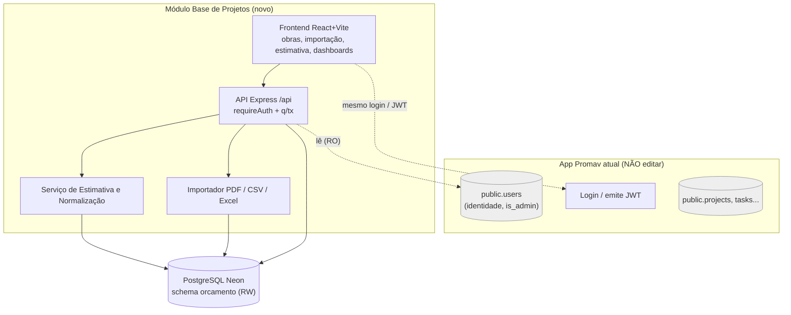
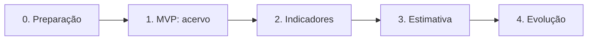

# 06 — Arquitetura, Integração e Roadmap

Como o módulo se encaixa no **sistema Promav existente**, agora com a stack **confirmada**.

> **Stack do sistema atual (confirmada):** React 18 + Vite (frontend) · Express 4 +
> Node (ESM) · PostgreSQL no Neon · autenticação **JWT Bearer + bcrypt**. Acesso ao
> banco via `pg` (`q`/`tx`), rotas REST sob `/api`, deploy no Render (+ alternativa
> Firebase/Cloud Run).
>
> **Restrição-chave:** *não é permitido editar o sistema atual*. Logo, o módulo é um
> **serviço/app separado** que **reutiliza** identidade e banco, sem alterar nada de `public.*`.

---

## 1. Princípios de arquitetura

1. **Aditivo, não invasivo** — o módulo vive em código próprio e em um **schema próprio
   no mesmo banco Neon** (`orcamento`). Nenhuma tabela do app (`public.*`) é alterada.
2. **Identidade compartilhada** — reaproveita a tabela `public.users` (somente leitura) e
   o **mesmo `JWT_SECRET`**, então o login é o mesmo (e-mail/senha já cadastrados).
3. **Mesma casa de código** — segue os padrões do backend atual (`q`/`tx`, `requireAuth`,
   `wrap`, SELECT com alias camelCase) e os **design tokens** do frontend (`tokens.css`/`kit.css`).
4. **Separar dados de regras** — normalização e motor de estimativa em uma camada própria,
   testável e parametrizável (RNF-14/15).
5. **API primeiro** — toda função relevante exposta em REST sob `/api`, igual ao app.

## 2. Stack do módulo (espelha o app)

| Camada | Tecnologia | Observação |
|--------|-----------|------------|
| Frontend | **React 18 + Vite 5** (JS/JSX, sem TS) | CSS puro reaproveitando `tokens.css` + `kit.css`. Sem lib de UI, igual ao app. |
| HTTP (front) | `fetch` encapsulado | Mesmo padrão de `src/data/api.js` (token no header `Authorization`). |
| Backend | **Express 4 + Node (ESM)** | Reutiliza os helpers `q`/`tx` (`pg`) e `requireAuth`/`signToken` do padrão atual. |
| Banco | **PostgreSQL (Neon)** | Mesmo cluster; objetos novos só no schema `orcamento` (ver [migration](../db/migrations/001_orcamento_schema.sql)). |
| Auth | **JWT Bearer + bcrypt** | Mesmo `JWT_SECRET`; token `{ sub: user.id }`, validade 7d. |
| Deploy | **Render** (Web Service + Static Site) | Novo serviço/app; mesma `DATABASE_URL` e `JWT_SECRET` por variável de ambiente. |

## 3. Visão em camadas



## 4. Componentes

| Componente | Responsabilidade |
|------------|------------------|
| **Frontend React+Vite** | Telas de obras, importação, busca de análogas, estimativa, dashboards. Visual idêntico (design tokens reaproveitados). |
| **API Express `/api`** | Contrato REST; `requireAuth` valida o JWT; SELECTs com alias camelCase como no app. |
| **Serviço de Estimativa/Normalização** | Regras do [doc 05](./05-regras-estimativa.md): atualização monetária, similaridade, métodos, faixas. Coberto por testes (RNF-16). |
| **Importador** | Lê **PDF, CSV e Excel** (formatos do histórico), valida e grava (RF-C01..C04). |
| **Schema `orcamento` (Neon)** | Persistência do [modelo de dados](./04-modelo-dados.md). Ver DDL em `db/migrations/001_orcamento_schema.sql`. |

<a id="5-integracao-com-o-sistema-existente-sem-edita-lo"></a>

## 5. Integração com o sistema existente (sem editá-lo)

| Ponto | Como | Por quê é não-invasivo |
|-------|------|------------------------|
| **Banco** | Novo schema `orcamento` no **mesmo** Neon; FKs só entre tabelas do próprio schema. | Não cria/altera objetos em `public.*`. |
| **Identidade** | A API do módulo lê `public.users` (e `is_admin`) apenas com `SELECT`. | Nenhum `INSERT/UPDATE/ALTER` na tabela do app. |
| **Login / SSO** | O módulo tem sua própria tela de login que valida **as mesmas credenciais** (mesmo bcrypt) e assina JWT com o **mesmo `JWT_SECRET`**. | Mesmo usuário e senha; nada muda no app. |
| **Autorização** | Admin global via `users.is_admin`; papéis do módulo (editor/leitura) numa tabela própria de `orcamento`, se necessário. | Regras vivem no módulo. |
| **Visual** | Cópia de `tokens.css`/`kit.css` no frontend novo. | Sem dependência do build do app. |
| **CORS / deploy** | Novo Web Service + Static Site no Render; `CORS_ORIGIN` inclui o domínio do módulo; `DATABASE_URL` e `JWT_SECRET` iguais. | Configuração isolada por variáveis de ambiente. |

> **Nota sobre SSO:** como `localStorage` é por origem, em domínios diferentes o usuário
> faz login no módulo com a **mesma conta** (experiência de credencial única). Um
> *single sign-on* com repasse de sessão sem novo login exigiria uma pequena adição no
> app atual (repasse de token) — fora da restrição atual, fica como evolução opcional.

## 6. Estrutura de pastas sugerida do módulo

Espelha a organização do app atual (backend `server/`, frontend `src/`), versionando
**código + documentação + migrations** juntos:

```
project-db/
├─ README.md
├─ docs/                      # esta documentação
├─ db/
│  └─ migrations/
│     └─ 001_orcamento_schema.sql   # schema do módulo (já criado)
├─ server/                    # backend Express (padrão do app: ESM, pg)
│  ├─ index.js                # rotas /api (obras, importação, estimativa, relatórios)
│  ├─ db.js                   # pool Neon + helpers q/tx (reuso do padrão atual)
│  ├─ auth.js                 # requireAuth/signToken com o MESMO JWT_SECRET
│  ├─ estimativa/             # normalização, similaridade, métodos (núcleo do doc 05)
│  └─ importacao/             # parsers PDF/CSV/Excel
├─ src/                       # frontend React+Vite
│  ├─ data/api.js             # cliente fetch (padrão do app)
│  ├─ styles/                 # cópia de tokens.css + kit.css
│  └─ screens/                # Obras, Importacao, Estimativa, Dashboards
├─ render.yaml                # Web Service + Static Site (DATABASE_URL, JWT_SECRET, CORS_ORIGIN)
└─ vite.config.js
```

<a id="7-roadmap-de-implantacao"></a>

## 7. Roadmap de implantação

Entrega incremental — cada fase gera valor por si só. Stack já definida, então a fase 0
foca em preparar o ambiente (criar o schema no Neon e o esqueleto do serviço).

| Fase | Objetivo | Principais requisitos | Resultado |
|:----:|----------|-----------------------|-----------|
| **0 — Preparação** | Rodar a migration `001` no Neon; scaffolding do serviço Express + app Vite reusando auth/tokens. | RF-H01..H02 | Esqueleto autenticado, conectado ao banco. |
| **1 — MVP: acervo** | Cadastrar obras e importar histórico (~3 anos); cadastros de referência e índices. | RF-A01..A06, RF-B01..B07, RF-C01..C02 | Base histórica navegável e segura. |
| **2 — Indicadores** | Normalização e indicadores; busca/comparação de obras (view `vw_obra_indicadores`). | RF-D01..D04, RF-E01..E03 | Custo/m² normalizado e desvios visíveis. |
| **3 — Motor de estimativa** | Estimar custo e prazo com faixa; métodos análogo/paramétrico; versionamento. | RF-F01..F07, RF-G02 | Estimativas baseadas em dados, auditáveis. |
| **4 — Evolução** | Dashboards, integração com o comercial, calibração com realizado, regressão/ML. | RF-F08, RF-G01/G03, RF-H03..H05 | Precisão crescente e visão gerencial. |



## 8. Principais riscos e mitigação

| Risco | Mitigação |
|-------|-----------|
| Histórico incompleto/inconsistente | Validação na importação (RF-C02), flag de elegibilidade (RF-B07), revisão de outliers (RNF-26). |
| Importar de **PDF** (menos estruturado) | Priorizar CSV/Excel; para PDF, extrair tabelas com revisão manual antes de gravar. |
| Poucas obras análogas → estimativa fraca | Nível de confiança transparente (RF-F04); combinar com bottom-up. |
| Acoplamento indevido ao app | Schema isolado + acesso só-leitura a `users`; sem FK para `public.*`. |
| LGPD | Tratar dados pessoais conforme RNF-09; auditoria (RNF-08). |

## 9. Pontos ainda a confirmar

1. **Colunas reais de `public.users`** além das vistas (`id, name, initials, color, email, is_admin, password_hash`) — confirmar antes do login do módulo.
2. **Domínio/origens** do novo frontend e backend (para `CORS_ORIGIN` e `VITE_API_URL`).
3. Se haverá, no futuro, **repasse de token** do app para SSO sem novo login (exige pequena adição no app — opcional).
4. **Papéis do módulo**: basta `is_admin` + "todos leem"? Ou criar tabela de acessos do orçamento (editor/leitura)?
5. Layout das **planilhas/PDFs** de orçamento históricos (para configurar o importador).

---

⬅️ Anterior: [05 — Regras de Estimativa](./05-regras-estimativa.md) · 🏠 [Voltar ao índice](../README.md)
